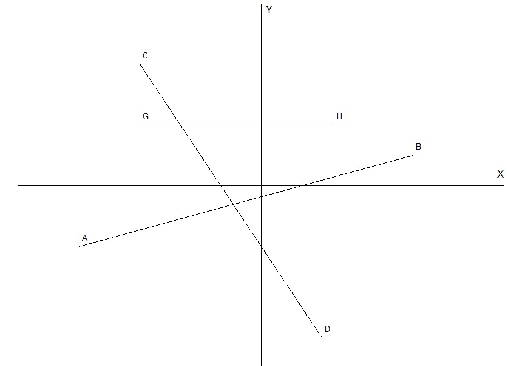
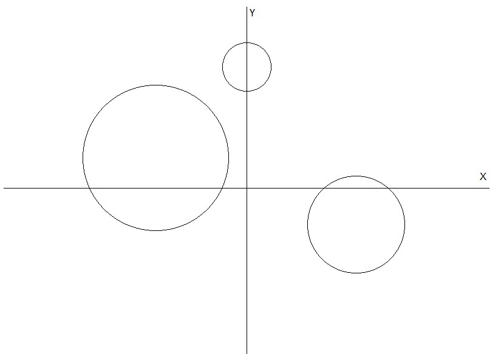
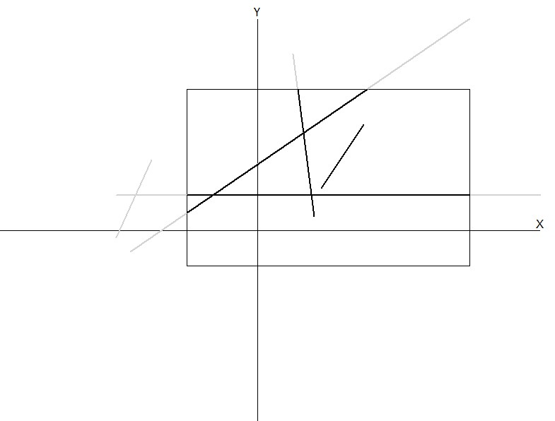
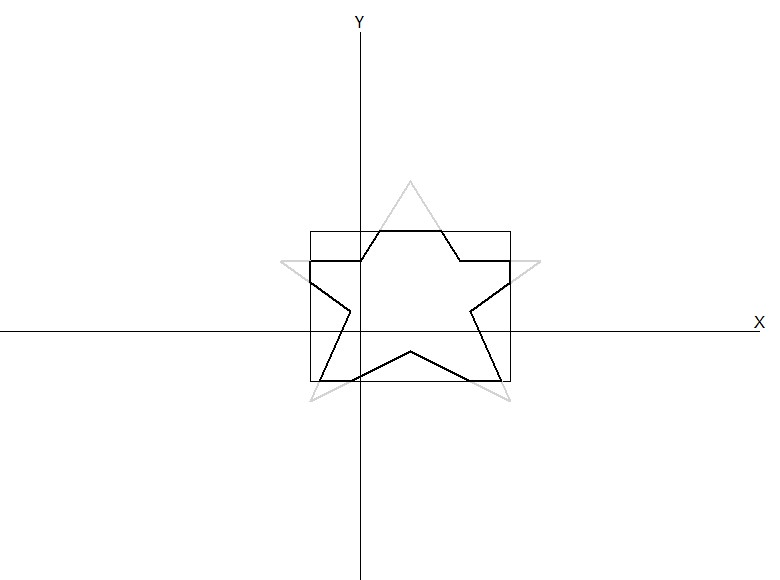
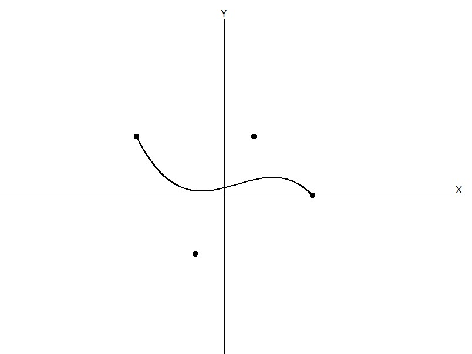
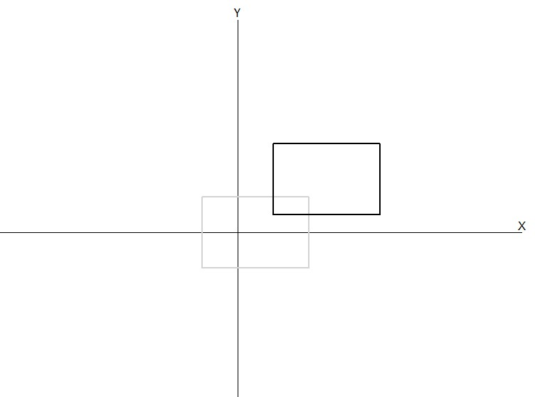
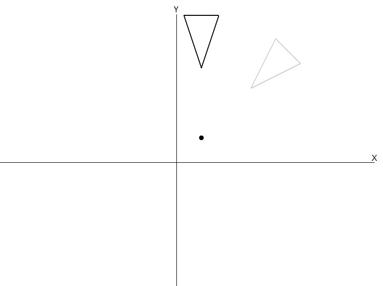
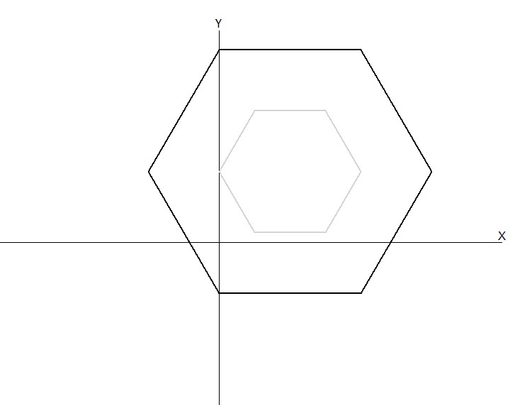
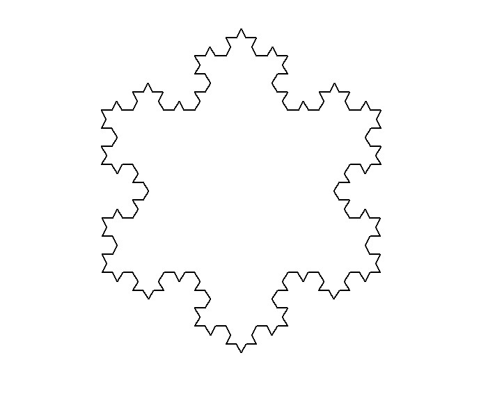

# 🖥️ Computer Graphics Lab

This repository contains implementations of classic computer graphics algorithms using Python’s `turtle` graphics library.  
Each experiment includes the **code** and its **output visualization**.

⚡ **Runs on Python 3.7 or newer**.  
🚀 **Zero setup needed** — no extra installations, no hidden dependencies.  
📦 Everything uses the built-in `turtle` module from Python’s standard library.  
▶️ Just pick a file and run it with:  

```bash
python filename.py
```

---

## 📌 1: Draw a line with the Bresenham Line Drawing algorithm

### Code
```python
import turtle

class Point:
    def __init__(self, x, y):
        self.x = x
        self.y = y

def draw_axes(t, width, height):
    t.pencolor("black")
    t.pensize(1)

    # X-axis
    t.penup(); t.goto(-width // 2, 0); t.pendown()
    t.goto(width // 2, 0)
    t.penup(); t.goto(width // 2 - 10, 10); t.write("X", font=("Arial", 12, "normal"))

    # Y-axis
    t.penup(); t.goto(0, -height // 2); t.pendown()
    t.goto(0, height // 2)
    t.penup(); t.goto(10, height // 2 - 20); t.write("Y", font=("Arial", 12, "normal"))
    t.penup()

def put_pixel(t, x, y, color="lime"):
    t.penup()
    t.goto(x, y)
    t.pencolor(color)
    t.dot(2)

def label(t, p: Point, text, color="black"):
    t.penup(); t.goto(p.x + 6, p.y + 6)
    t.pencolor(color); t.write(text, font=("Arial", 10, "normal"))
    t.penup()

def bresenham_line(t, p1: Point, p2: Point, color="black"):
    x1, y1 = p1.x, p1.y
    x2, y2 = p2.x, p2.y

    if x1 > x2:
        x1, x2 = x2, x1
        y1, y2 = y2, y1

    dx = x2 - x1
    dy = abs(y2 - y1)
    sx = 1
    sy = 1 if y2 >= y1 else -1

    if dy <= dx:
        p = 2 * dy - dx
        x, y = x1, y1
        put_pixel(t, x, y, color)
        for _ in range(dx):
            x += sx
            if p < 0:
                p += 2 * dy
            else:
                y += sy
                p += 2 * dy - 2 * dx
            put_pixel(t, x, y, color)
    else:
        p = 2 * dx - dy
        x, y = x1, y1
        put_pixel(t, x, y, color)
        for _ in range(dy):
            y += sy
            if p < 0:
                p += 2 * dx
            else:
                x += sx
                p += 2 * dx - 2 * dy
            put_pixel(t, x, y, color)

if __name__ == "__main__":
    WIDTH, HEIGHT = 800, 600
    screen = turtle.Screen()
    screen.setup(WIDTH, HEIGHT)
    screen.title("Bresenham Line Drawing Algorithm")
    screen.bgcolor("white")
    screen.tracer(2, 0)

    t = turtle.Turtle()
    t.speed(0)
    t.hideturtle()
    draw_axes(t, WIDTH, HEIGHT)

    A = Point(-300, -100)
    B = Point(250, 50)
    C = Point(-200, 200)
    D = Point(100, -250)
    G = Point(-200, 100)
    H = Point(120, 100)

    for (p, q, col, name1, name2) in [
        (A, B, "black",  "A", "B"),
        (C, D, "black","C", "D"),
        (G, H, "black","G","H"),
    ]:
        label(t, p, name1)
        label(t, q, name2)
        bresenham_line(t, p, q, color=col)
        
    turtle.done()
```
### 🖼️ Output


## 📌 Experiment-2: Draw a circle with the Midpoint Circle Drawing algorithm

### Code
```python
import turtle

class Point:
    def __init__(self, x, y):
        self.x = x
        self.y = y

def draw_axes(t, width, height):
    t.pencolor("black")
    t.pensize(1)

    # X-axis
    t.penup(); t.goto(-width // 2, 0); t.pendown()
    t.goto(width // 2, 0)
    t.penup(); t.goto(width // 2 - 10, 10); t.write("X", align="center", font=("Arial", 12, "normal"))

    # Y-axis
    t.penup(); t.goto(0, -height // 2); t.pendown()
    t.goto(0, height // 2)
    t.penup(); t.goto(10, height // 2 - 20); t.write("Y", align="center", font=("Arial", 12, "normal"))
    t.penup()

def put_pixel(t, x, y, color="lime"):
    t.penup()
    t.goto(int(x), int(y))
    t.pencolor(color)
    t.dot(2)

def plot_octant_points(t, xc, yc, x, y, color):
    put_pixel(t, xc + x, yc + y, color)
    put_pixel(t, xc + y, yc + x, color)
    put_pixel(t, xc - y, yc + x, color)
    put_pixel(t, xc - x, yc + y, color)
    put_pixel(t, xc - x, yc - y, color)
    put_pixel(t, xc - y, yc - x, color)
    put_pixel(t, xc + y, yc - x, color)
    put_pixel(t, xc + x, yc - y, color)

def midpoint_circle(t, center: Point, r: int, color="lime"):
    x = 0
    y = r

    p = 1 - r

    plot_octant_points(t, center.x, center.y, x, y, color)

    while x < y:
        x += 1
        if p < 0:
            p += 2 * x + 1
        else:
            y -= 1
            p += 2 * (x - y) + 1

        plot_octant_points(t, center.x, center.y, x, y, color)

WIDTH, HEIGHT = 800, 600
screen = turtle.Screen()
screen.setup(WIDTH, HEIGHT)
screen.title("Midpoint Circle Drawing (8-way Symmetry)")
screen.bgcolor("white")
screen.tracer(2, 0)

t = turtle.Turtle()
t.hideturtle()
t.speed(0)
t.pensize(2)

draw_axes(t, WIDTH, HEIGHT)

C = Point(-150, 50)
midpoint_circle(t, C, 120, color="black")

C2 = Point(180, -60)
midpoint_circle(t, C2, 80, color="black")

C3 = Point(0, 200)
midpoint_circle(t, C3, 40, color="black")

turtle.done()
```
### 🖼️ Output


## 📌 Experiment-3: Implement the Cohen-Sutherland Line Clipping algorithm

### Code
```python
import turtle

# Clipping window boundaries
x_left, x_right = -100, 300
y_bottom, y_top = -50, 200

# Region codes
LEFT, RIGHT, BOTTOM, TOP = 1, 2, 4, 8

def draw_line(t, x1, y1, x2, y2, color):
    t.pencolor(color)
    t.pensize(2)
    t.penup()
    t.goto(x1, y1)
    t.pendown()
    t.goto(x2, y2)
    t.penup()

def draw_axes(t, width, height):
    t.pencolor("black")
    t.pensize(1)

    t.penup()
    t.goto(-width / 2, 0)
    t.pendown()
    t.goto(width / 2, 0)
    t.write("X", align="center", font=("Arial", 12, "normal"))

    t.penup()
    t.goto(0, -height / 2)
    t.pendown()
    t.goto(0, height / 2)
    t.write("Y", align="center", font=("Arial", 12, "normal"))
    t.penup()

def region_code(x, y):
    code = 0
    if x < x_left:
        code |= LEFT
    elif x > x_right:
        code |= RIGHT
    if y < y_bottom:
        code |= BOTTOM
    elif y > y_top:
        code |= TOP
    return code

def cohen_sutherland(t, x1, y1, x2, y2, color):
    code1 = region_code(x1, y1)
    code2 = region_code(x2, y2)

    while True:
        if not (code1 | code2):
            draw_line(t, x1, y1, x2, y2, color)
            break
        elif code1 & code2:
            break
        else:
            if code1:
                code_out = code1
            else:
                code_out = code2

            if code_out & TOP:
                x = x1 + (x2 - x1) * (y_top - y1) / (y2 - y1)
                y = y_top
            elif code_out & BOTTOM:
                x = x1 + (x2 - x1) * (y_bottom - y1) / (y2 - y1)
                y = y_bottom
            elif code_out & RIGHT:
                y = y1 + (y2 - y1) * (x_right - x1) / (x2 - x1)
                x = x_right
            elif code_out & LEFT:
                y = y1 + (y2 - y1) * (x_left - x1) / (x2 - x1)
                x = x_left

            if code_out == code1:
                x1, y1 = x, y
                code1 = region_code(x1, y1)
            else:
                x2, y2 = x, y
                code2 = region_code(x2, y2)

WIDTH, HEIGHT = 800, 600
screen = turtle.Screen()
screen.title("Cohen-Sutherland Line Clipping")
screen.setup(width=WIDTH, height=HEIGHT)
screen.bgcolor("white")

t = turtle.Turtle()
t.hideturtle()
t.speed(0)
t.pensize(2)

draw_axes(t, WIDTH, HEIGHT)

# Draw the clipping rectangle
t.pencolor("black")
t.penup()
t.goto(x_left, y_bottom)
t.pendown()
t.goto(x_right, y_bottom)
t.goto(x_right, y_top)
t.goto(x_left, y_top)
t.goto(x_left, y_bottom)
t.penup()

lines = [
    (90, 60, 150, 150),
    (50, 250, 80, 20),
    (-180, -30, 300, 300),
    (-200, -10, -150, 100),
    (-200, 50, 400, 50)
]
for x1, y1, x2, y2 in lines:
    draw_line(t, x1, y1, x2, y2, 'lightgray')
    cohen_sutherland(t, x1, y1, x2, y2, "black")

screen.mainloop()
```
### 🖼️ Output


## 📌 Experiment-4: Implement the Sutherland-Hodgman Polygon Clipping algorithm

### Code
```python
import turtle

class Point:
    def __init__(self, x, y):
        self.x = x
        self.y = y

wMin = Point(-50, -50)
wMax = Point(150, 100)

LEFT, RIGHT, BOTTOM, TOP = 0, 1, 2, 3

def draw_axes(t, width, height):
    t.pencolor("black")
    t.pensize(1)

    t.penup()
    t.goto(-width / 2, 0)
    t.pendown()
    t.goto(width / 2, 0)
    t.write("X", align="center", font=("Arial", 12, "normal"))

    t.penup()
    t.goto(0, -height / 2)
    t.pendown()
    t.goto(0, height / 2)
    t.write("Y", align="center", font=("Arial", 12, "normal"))
    
    t.penup()

def inside(p, edge):
    if edge == LEFT:
        return p.x >= wMin.x
    elif edge == RIGHT:
        return p.x <= wMax.x
    elif edge == BOTTOM:
        return p.y >= wMin.y
    elif edge == TOP:
        return p.y <= wMax.y

def intersect(p1, p2, edge):
    if p1.x != p2.x:
        m = (p2.y - p1.y) / (p2.x - p1.x)
    else:
        m = float('inf')

    if edge == LEFT:
        x = wMin.x
        y = p1.y + (wMin.x - p1.x) * m
    elif edge == RIGHT:
        x = wMax.x
        y = p1.y + (wMax.x - p1.x) * m
    elif edge == BOTTOM:
        y = wMin.y
        x = p1.x + (wMin.y - p1.y) / m if m != 0 else p1.x
    elif edge == TOP:
        y = wMax.y
        x = p1.x + (wMax.y - p1.y) / m if m != 0 else p1.x

    return Point(x, y)

def clip_polygon(points, edge):
    clipped = []
    for i in range(len(points)):
        curr = points[i]
        prev = points[i - 1]
        curr_in = inside(curr, edge)
        prev_in = inside(prev, edge)

        if prev_in and curr_in:
            clipped.append(curr)
        elif not prev_in and curr_in:
            clipped.append(intersect(prev, curr, edge))
            clipped.append(curr)
        elif prev_in and not curr_in:
            clipped.append(intersect(prev, curr, edge))
    return clipped

def draw_polygon(t, points, color):
    t.pensize(2)
    if not points:
        return
    t.pencolor(color)
    t.penup()
    t.goto(points[0].x, points[0].y)
    t.pendown()
    for p in points[1:] + [points[0]]:
        t.goto(p.x, p.y)
    t.penup()

def draw_clip_window(t):
    t.pencolor("black")
    t.penup()
    t.goto(wMin.x, wMin.y)
    t.pendown()
    t.goto(wMax.x, wMin.y)
    t.goto(wMax.x, wMax.y)
    t.goto(wMin.x, wMax.y)
    t.goto(wMin.x, wMin.y)
    t.penup()

star_points = [
    Point(  50, 150),
    Point( 100,  70),
    Point( 180,  70),
    Point( 110,  20),
    Point( 150, -70),
    Point(  50, -20),
    Point( -50, -70),
    Point( -10,  20),
    Point( -80,  70),
    Point(   0,  70)
]

WIDTH, HEIGHT = 800, 600
screen = turtle.Screen()
screen.setup(WIDTH, HEIGHT)
screen.title("Sutherland-Hodgman Polygon Clipping")
screen.bgcolor("white")

t = turtle.Turtle()
t.hideturtle()
t.speed(0)

draw_axes(t, WIDTH, HEIGHT)

draw_clip_window(t)
draw_polygon(t, star_points, "lightgray")

clipped = star_points
for edge in [LEFT, RIGHT, BOTTOM, TOP]:
    clipped = clip_polygon(clipped, edge)

draw_polygon(t, clipped, "black")

turtle.done()
```
### 🖼️ Output


## 📌 Experiment-5: Create the Bezier Curve

### Code
```python
import turtle

def factorial(n):
    if n < 2:
        return 1
    return n * factorial(n - 1)

def nCr(n, r):
    return factorial(n) / (factorial(r) * factorial(n - r))

def bezier_function(k, n, u):
    return nCr(n, k) * (u ** k) * ((1 - u) ** (n - k))

def draw_axes(t, width, height):
    t.pencolor("black")
    t.pensize(1)

    t.penup()
    t.goto(-width / 2, 0)
    t.pendown()
    t.goto(width / 2, 0)
    t.write("X", align="center", font=("Arial", 12, "normal"))

    t.penup()
    t.goto(0, -height / 2)
    t.pendown()
    t.goto(0, height / 2)
    t.write("Y", align="center", font=("Arial", 12, "normal"))
    t.penup()

def draw_bezier(t, points):

    # Draw control points
    t.pencolor("black")
    for x, y in points:
        t.penup()
        t.goto(x, y)
        t.pendown()
        t.dot(10)

    n = len(points) - 1
    eps = 0.001
    t.pencolor("black")

    prev = None
    u = 0.0
    while u <= 1.0:
        x = 0
        y = 0
        for k in range(n + 1):
            b = bezier_function(k, n, u)
            x += points[k][0] * b
            y += points[k][1] * b
        if prev:
            t.penup()
            t.goto(prev)
            t.pendown()
            t.goto(x, y)
        prev = (x, y)
        u += eps

WIDTH, HEIGHT = 800, 600
screen = turtle.Screen()
screen.title("Bézier Curve")
screen.setup(width=WIDTH, height=HEIGHT)
screen.bgcolor("white")
screen.tracer(2, 0)

t = turtle.Turtle()
t.hideturtle()
t.speed(0.0)
draw_axes(t, WIDTH, HEIGHT)
t.pensize(2)

control_points = [
    (-150, 100),
    (-50, -100),
    (50, 100),
    (150, 0)
]

draw_bezier(t, control_points)

screen.mainloop()
```
### 🖼️ Output


## 📌 6: Simulate two-dimensional geometric Translation

### Code
```python
import turtle

def draw_polygon(t, poly, color):
    t.pencolor(color)
    t.penup()
    t.goto(poly[0][0], poly[0][1])
    t.pendown()
    for i in range(len(poly)):
        next_vertex = poly[(i + 1) % len(poly)]
        t.goto(next_vertex[0], next_vertex[1])
    t.penup()

def draw_axes(t, width, height):
    t.pencolor("black")
    t.pensize(1)

    t.penup()
    t.goto(-width / 2, 0)
    t.pendown()
    t.goto(width / 2, 0)
    t.write("X", align="center", font=("Arial", 12, "normal"))

    t.penup()
    t.goto(0, -height / 2)
    t.pendown()
    t.goto(0, height / 2)
    t.write("Y", align="center", font=("Arial", 12, "normal"))
    
    t.penup()

WIDTH, HEIGHT = 800, 600
screen = turtle.Screen()
screen.title("2D Translation")
screen.setup(width=WIDTH, height=HEIGHT)
screen.bgcolor("white")

t = turtle.Turtle()
t.hideturtle()
t.speed(1)

draw_axes(t, WIDTH, HEIGHT)
t.pensize(2)
original_coordinates = [
    (-50, -50),
    (100, -50),
    (100, 50),
    (-50, 50)
]
tx, ty = (100, 75)
translated_coordinates = []

for point in original_coordinates:
    x, y = point
    new_x = x + tx
    new_y = y + ty
    translated_coordinates.append((new_x, new_y))

draw_polygon(t, original_coordinates, "lightgray")
draw_polygon(t, translated_coordinates, "black")

screen.mainloop()
```
### 🖼️ Output


## 📌 7: Simulate two-dimensional geometric Rotation

### Code
```python
import turtle
import math

def to_radian(degree):
    return (degree * math.pi) / 180

def draw_polygon(t, poly, color):
    t.pensize(2)
    t.pencolor(color)
    t.penup()
    t.goto(poly[0][0], poly[0][1])
    t.pendown()
    for i in range(len(poly)):
        next_vertex = poly[(i + 1) % len(poly)]
        t.goto(next_vertex[0], next_vertex[1])
    t.penup()

def draw_axes(t, width, height):
    t.pencolor("black")
    t.pensize(1)

    t.penup()
    t.goto(-width / 2, 0)
    t.pendown()
    t.goto(width / 2, 0)
    t.write("X", align="center", font=("Arial", 12, "normal"))

    t.penup()
    t.goto(0, -height / 2)
    t.pendown()
    t.goto(0, height / 2)
    t.write("Y", align="center", font=("Arial", 12, "normal"))
    
    t.penup()

def mark_pivot_point(t, pivot_point, color):
    t.penup()
    t.goto(pivot_point[0], pivot_point[1])
    t.dot(10, color)

screen = turtle.Screen()
screen.title("2D Polygon Rotation")
screen.setup(width=800, height=600)
screen.bgcolor("white")

t = turtle.Turtle()
t.hideturtle()
t.hideturtle()
t.speed(0.6)
t.pensize(2)

original_coordinates = [
    (150, 150),
    (250, 200),
    (200, 250)
]
angle = 45
rx, ry = (50, 50)

draw_axes(t, 800, 600)
mark_pivot_point(t, (rx, ry), "black")

rotated_coordinates = []

for point in original_coordinates:
    x, y = point

    x_shifted = x - rx
    y_shifted = y - ry

    rad_angle = to_radian(angle)
    cos_angle = math.cos(rad_angle)
    sin_angle = math.sin(rad_angle)
    
    x_rotated = x_shifted * cos_angle - y_shifted * sin_angle
    y_rotated = x_shifted * sin_angle + y_shifted * cos_angle

    final_x = x_rotated + rx
    final_y = y_rotated + ry
    
    rotated_coordinates.append((final_x, final_y))

draw_polygon(t, original_coordinates, "lightgray")
draw_polygon(t, rotated_coordinates, "black")

screen.mainloop()
```
### 🖼️ Output


## 📌 8: Simulate two-dimensional geometric Scaling

### Code
```python
import turtle

def draw_polygon(t, poly, color):
    t.pencolor(color)
    t.penup()
    t.goto(poly[0][0], poly[0][1])
    t.pendown()
    for i in range(len(poly)):
        next_vertex = poly[(i + 1) % len(poly)]
        t.goto(next_vertex[0], next_vertex[1])
    t.penup()

def draw_axes(t, width, height):
    t.pencolor("black")
    t.pensize(1)

    t.penup()
    t.goto(-width / 2, 0)
    t.pendown()
    t.goto(width / 2, 0)
    t.write("X", align="center", font=("Arial", 12, "normal"))

    t.penup()
    t.goto(0, -height / 2)
    t.pendown()
    t.goto(0, height / 2)
    t.write("Y", align="center", font=("Arial", 12, "normal"))
    
    t.penup()

WIDTH, HEIGHT = 800, 600
screen = turtle.Screen()
screen.title("2D Fixed-Point Scaling")
screen.setup(width=WIDTH, height=HEIGHT)
screen.bgcolor("white")

t = turtle.Turtle()
t.hideturtle()
t.speed(0.6)

draw_axes(t, WIDTH, HEIGHT)
t.pensize(2)

original_coordinates = [
    (200, 100),
    (150, 186),
    (50, 186),
    (0, 100),
    (50, 14),
    (150, 14)
]

# Calculate the centroid (fixed point)
n = len(original_coordinates)
xf = sum(x for x, y in original_coordinates) / n
yf = sum(y for x, y in original_coordinates) / n

sx, sy = 2, 2
scaled_coordinates = []

for x, y in original_coordinates:
    new_x = xf + (x - xf) * sx
    new_y = yf + (y - yf) * sy
    scaled_coordinates.append((new_x, new_y))

draw_polygon(t, original_coordinates, "lightgray")
draw_polygon(t, scaled_coordinates, "black")

screen.mainloop()
```
### 🖼️ Output


## 📌 9: Draw the Snowflake Pattern with Fractal Geometry

### Code
```python
import turtle
import math

def draw_koch(t, p1, p5, it):
    if it == 0:
        t.penup()
        t.goto(p1)
        t.pendown()
        t.goto(p5)
        return

    dx = (p5[0] - p1[0]) / 3
    dy = (p5[1] - p1[1]) / 3

    x1 = p1[0] + dx
    y1 = p1[1] + dy

    x3 = p1[0] + 2 * dx
    y3 = p1[1] + 2 * dy

    x2 = x1 + (x3 - x1) / 2 + math.sqrt(3) * (y3 - y1) / 2
    y2 = y1 + (y3 - y1) / 2 - math.sqrt(3) * (x3 - x1) / 2


    draw_koch(t, p1, (x1, y1), it - 1)
    draw_koch(t, (x1, y1), (x2, y2), it - 1)
    draw_koch(t, (x2, y2), (x3, y3), it - 1)
    draw_koch(t, (x3, y3), p5, it - 1)

WIDTH, HEIGHT = 800, 600
screen = turtle.Screen()
screen.title("Koch Snowflake")
screen.setup(width=WIDTH, height=HEIGHT)
screen.bgcolor("white")

t = turtle.Turtle()
t.hideturtle()
t.pensize(2)
t.pencolor("black")
t.speed(0)

p0 = (0, 250)
p1 = (-200, -100)
p2 = (200, -100)

it = 3
draw_koch(t, p0, p1, it)
draw_koch(t, p1, p2, it)
draw_koch(t, p2, p0, it)

screen.mainloop()
```
### 🖼️ Output

